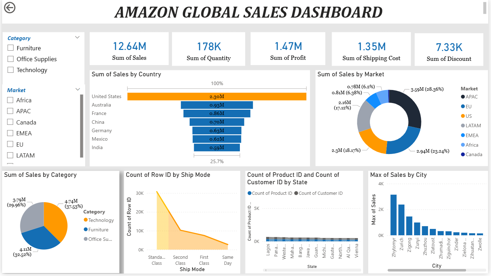

📊 Amazon Global Sales Dashboard (Power BI)

🚀 Project Overview

The Amazon Global Sales Dashboard is an interactive data visualization project built using Power BI. It converts raw sales data into meaningful insights, allowing users to analyze business performance across different countries, markets, and product categories.

🎯 Objectives

Monitor overall sales performance
Track key business metrics
Analyze sales across regions and categories
Support data-driven decision-making

📌 Key Features
KPI Cards: Total Sales, Profit, Quantity, Shipping Cost, Discounts
Sales Analysis by Country, Market, Category, and City
Interactive Visualizations: Bar charts, Donut charts, Trend charts
Dynamic Filters (Slicers) for Market and Category
Clean and professional dashboard design

🛠️ Tools & Technologies
Power BI – Dashboard creation and visualization
Excel / CSV – Data source

📷 Dashboard Preview

Add your dashboard screenshot here

📊 Insights
Identified top-performing countries and cities
Compared sales contribution across global markets
Analyzed category-wise performance
Evaluated shipping methods and cost impact

📚 Learning Outcomes
Data cleaning and transformation
Creating KPIs and measures
Designing interactive dashboards
Applying data visualization best practices
Presenting insights clearly for business users

📂 Project Structure
Amazon-Global-Sales-Dashboard/
│
├── Amazon_Dashboard.pbix
├── dataset.csv
└── README.md

💡 Future Enhancements
Add time-based analysis (monthly / yearly trends)
Implement forecasting
Publish dashboard to Power BI Service

🙌 Acknowledgement

This project was developed as part of a Data Analytics using Power BI workshop conducted by Tech Tip 24.

📬 Contact

Vijitha S
📧 vijithas799@gmail.com

⭐ Support

If you found this project useful, consider giving it a ⭐ on GitHub
